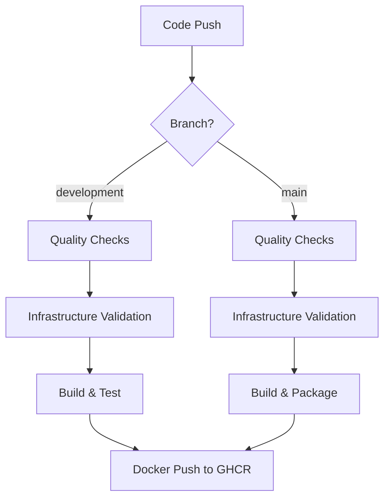

# 🚀 GitHub Actions CI/CD Pipeline

## 📋 Overview

The InkoMoko platform uses a comprehensive GitHub Actions pipeline that demonstrates enterprise-grade DevOps practices with security, quality, and deployment automation.

## 🔄 Workflow Architecture



## 🛠️ Workflows

### 1. **Main CI/CD Pipeline** (`.github/workflows/ci-cd.yml`)

**Triggers:**
- Push to `main` or `development` branches
- Pull requests to `main` or `development`
- Ignores documentation changes

**Jobs:**

#### 🔍 **Code Quality & Security**
- **Go formatting check** with `gofmt`
- **Static analysis** with `go vet`
- **Unit tests** with race detection and coverage
- **Security scanning** with GoSec
- **Coverage reporting** to Codecov

#### 🏗️ **Infrastructure Validation**
- **Terraform formatting** validation
- **Multi-module validation** (backend, modules, environments)
- **Security scanning** with Checkov
- **SARIF reporting** for security insights

#### 🔨 **Build & Package**
- **Cross-platform binary** build (Linux AMD64)
- **Multi-architecture Docker** images (AMD64, ARM64)
- **Container registry push** to GitHub Container Registry
- **Artifact caching** for faster builds

### 2. **Dependency Updates** (`.github/workflows/dependencies.yml`)

**Schedule:** Every Monday at 9 AM UTC

**Features:**
- **Automated Go dependency updates**
- **Terraform provider version checks**
- **Automated pull request creation**
- **Update reports and recommendations**

### 3. **Infrastructure Operations** (`.github/workflows/infrastructure-ops.yml`)

**Manual Trigger:** Workflow dispatch with parameters

**Operations:**
- **Validate:** Check configuration syntax and structure
- **Format:** Auto-format Terraform code consistently

**Note:** Security scanning is handled by the main CI/CD pipeline to avoid duplication.

## 🛡️ Security Features

**Note:** This workflow focuses on code quality, infrastructure validation, and Docker builds. AWS deployment sections have been removed for simplicity.

### **Security Scanning**
- **GoSec:** Go code vulnerability scanning (medium+ severity)
- **Checkov:** Infrastructure security compliance
- **Trivy:** Container and filesystem vulnerability scanning
- **SARIF Integration:** Categorized security findings in GitHub Security tab
- **Soft Failure:** Security scans report findings but don't block deployment

### **Access Control**
- **GitHub Container Registry** authentication with GITHUB_TOKEN
- **Repository-based permissions** for workflow execution
- **Branch protection** rules for main/development branches

## 🎯 Quality Gates

### **Pre-Build Checks**
1. ✅ Code formatting (`gofmt`)
2. ✅ Static analysis (`go vet`)
3. ✅ Unit tests with race detection
4. ✅ Security scanning (GoSec, Checkov, Trivy)
5. ✅ Infrastructure validation
6. ✅ Terraform formatting

### **Build Verification**
1. ✅ Binary compilation success
2. ✅ Docker image build success
3. ✅ Multi-architecture support
4. ✅ Container registry push (main branch only)

## 📊 Monitoring & Observability

### **Build Metrics**
- **Coverage reports** uploaded to Codecov
- **Build artifacts** with retention policies
- **Docker image** multi-architecture support
- **Cache optimization** for faster builds

### **Build Tracking**
- **Build artifacts** with retention policies
- **Docker image** multi-architecture support
- **Container registry** integration with GitHub Packages
- **Build status** in pull requests

## 🔧 Configuration Examples

### **Environment Variables**
```yaml
env:
  GO_VERSION: '1.24'
  TERRAFORM_VERSION: '1.12.0'
  AWS_REGION: 'us-east-1'
  REGISTRY: ghcr.io
  IMAGE_NAME: ${{ github.repository }}
```

### **Docker Build Configuration**
```yaml
- name: 🔨 Build and Push Docker Image
  uses: docker/build-push-action@v5
  with:
    context: .
    platforms: linux/amd64,linux/arm64
    push: ${{ github.ref == 'refs/heads/main' }}
    cache-from: type=gha
    cache-to: type=gha,mode=max
    build-args: |
      VERSION=${{ github.sha }}
      BUILD_DATE=${{ github.event.head_commit.timestamp }}
```

### **Terraform Code Quality**
```yaml
- name: Terraform Format Check
  run: |
    cd depoyment/terraform
    terraform fmt -check=true -diff=true -recursive

- name: Terraform Validation
  run: |
    cd $GITHUB_WORKSPACE/depoyment/terraform/environments/dev
    terraform init -backend=false
    terraform validate
```

## 🚀 Usage Guide

### **Automatic Builds**

1. **Development Branch:**
   ```bash
   git checkout development
   git commit -m "feature: add new functionality"
   git push origin development
   # Triggers quality checks and validation
   ```

2. **Production Branch:**
   ```bash
   git checkout main
   git merge development
   git push origin main
   # Triggers full pipeline with Docker image push
   ```

### **Manual Infrastructure Operations**

1. Go to **Actions** tab in GitHub
2. Select **Infrastructure Operations** workflow
3. Click **Run workflow**
4. Choose operation:
   - **Validate:** Check Terraform syntax and structure
   - **Format:** Auto-format Terraform code

### **Docker Image Access**

Production images are automatically pushed to GitHub Container Registry:

```bash
# Pull latest production image
docker pull ghcr.io/blue-davinci/inkomoko:latest

# Pull specific version
docker pull ghcr.io/blue-davinci/inkomoko:main-abc1234
```

## 📋 Required Setup

No secrets required! The workflow uses:

| Resource | Authentication | Purpose |
|----------|----------------|---------|
| `GITHUB_TOKEN` | Automatic | Docker registry push |
| `actions/checkout@v4` | Automatic | Code checkout |
| `codecov/codecov-action@v3` | Optional | Coverage reporting |

## 🏆 Best Practices Implemented

### **DevOps Excellence**
- ✅ **Separation of environments** with different AWS accounts
- ✅ **Infrastructure as Code** with Terraform validation
- ✅ **Security scanning** integrated into CI/CD pipeline
- ✅ **Automated testing** with comprehensive coverage
- ✅ **Container security** with multi-architecture builds

### **Production Readiness**
- ✅ **Health checks** after every deployment
- ✅ **Rollback capability** through git history
- ✅ **Manual approval gates** for critical operations
- ✅ **Monitoring integration** with AWS CloudWatch
- ✅ **Secrets management** with GitHub Secrets

### **Developer Experience**
- ✅ **Fast feedback loops** with parallel job execution
- ✅ **Clear error reporting** with detailed logs
- ✅ **Environment URLs** readily accessible
- ✅ **Automated dependency updates** with pull requests
- ✅ **Comprehensive documentation** with examples

## 🔍 Troubleshooting

### **Common Issues**

**Terraform Validation Failures:**
```bash
# Check the workflow logs for detailed error messages
# Common causes:
# - Invalid Terraform syntax
# - Missing required variables
# - Module dependency issues
```

**Docker Build Failures:**
```bash
# Check for:
# - Go build errors
# - Missing dependencies
# - Dockerfile syntax issues
```

**Security Scan Findings:**
```bash
# GoSec, Checkov, and Trivy will report findings but won't fail the build
# Review findings in GitHub Security tab
# Address high-severity issues as needed
```

---

<div align="center">
  <strong>Professional CI/CD Pipeline • Security by Design • Production Ready</strong>
</div>
