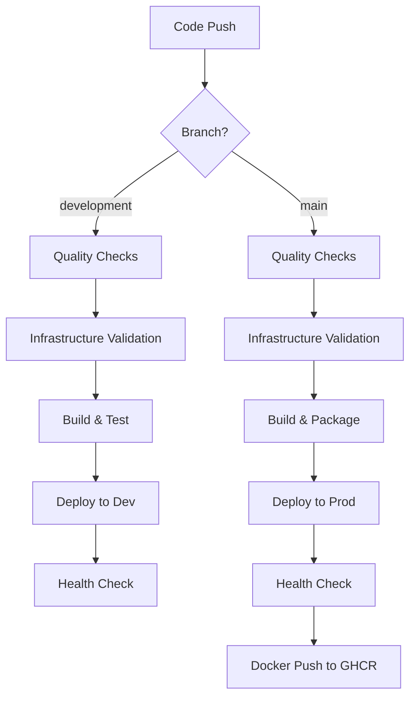

# 🚀 GitHub Actions CI/CD Pipeline

## 📋 Overview

The InkoMoko platform uses a comprehensive GitHub Actions pipeline that demonstrates enterprise-grade DevOps practices with security, quality, and deployment automation.

## 🔄 Workflow Architecture



## 🛠️ Workflows

### 1. **Main CI/CD Pipeline** (`.github/workflows/ci-cd.yml`)

**Triggers:**
- Push to `main` or `development` branches
- Pull requests to `main` or `development`
- Ignores documentation changes

**Jobs:**

#### 🔍 **Code Quality & Security**
- **Go formatting check** with `gofmt`
- **Static analysis** with `go vet`
- **Unit tests** with race detection and coverage
- **Security scanning** with GoSec
- **Coverage reporting** to Codecov

#### 🏗️ **Infrastructure Validation**
- **Terraform formatting** validation
- **Multi-module validation** (backend, modules, environments)
- **Security scanning** with Checkov
- **SARIF reporting** for security insights

#### 🔨 **Build & Package**
- **Cross-platform binary** build (Linux AMD64)
- **Multi-architecture Docker** images (AMD64, ARM64)
- **Container registry push** to GitHub Container Registry
- **Artifact caching** for faster builds

#### 🚀 **Deployment**
- **Development environment** (on `development` branch)
- **Production environment** (on `main` branch)
- **Health checks** post-deployment
- **Environment URLs** in GitHub UI

### 2. **Dependency Updates** (`.github/workflows/dependencies.yml`)

**Schedule:** Every Monday at 9 AM UTC

**Features:**
- **Automated Go dependency updates**
- **Terraform provider version checks**
- **Automated pull request creation**
- **Update reports and recommendations**

### 3. **Infrastructure Operations** (`.github/workflows/infrastructure-ops.yml`)

**Manual Trigger:** Workflow dispatch with parameters

**Operations:**
- **Validate:** Check configuration syntax and structure
- **Format:** Auto-format Terraform code consistently

**Note:** Security scanning is handled by the main CI/CD pipeline to avoid duplication.

## 🛡️ Security Features

### **Secrets Management**
```yaml
# Development Environment
AWS_ACCESS_KEY_ID: ${{ secrets.AWS_ACCESS_KEY_ID }}
AWS_SECRET_ACCESS_KEY: ${{ secrets.AWS_SECRET_ACCESS_KEY }}

# Production Environment (Separate Credentials)
AWS_ACCESS_KEY_ID_PROD: ${{ secrets.AWS_ACCESS_KEY_ID_PROD }}
AWS_SECRET_ACCESS_KEY_PROD: ${{ secrets.AWS_SECRET_ACCESS_KEY_PROD }}
```

### **Security Scanning**
- **GoSec:** Go code vulnerability scanning (medium+ severity)
- **Checkov:** Infrastructure security compliance
- **Trivy:** Container and filesystem vulnerability scanning
- **SARIF Integration:** Categorized security findings in GitHub Security tab
- **Soft Failure:** Security scans report findings but don't block deployment

### **Access Control**
- **Environment protection** rules for production
- **Manual approval** required for destructive operations
- **Separate AWS credentials** for each environment
- **Least privilege** IAM policies

## 🎯 Quality Gates

### **Pre-Deployment Checks**
1. ✅ Code formatting (`gofmt`)
2. ✅ Static analysis (`go vet`)
3. ✅ Unit tests with race detection
4. ✅ Security scanning (GoSec, Checkov)
5. ✅ Infrastructure validation
6. ✅ Terraform formatting

### **Post-Deployment Verification**
1. ✅ Health check endpoints
2. ✅ Application availability
3. ✅ Infrastructure state validation
4. ✅ Security compliance reports

## 📊 Monitoring & Observability

### **Build Metrics**
- **Coverage reports** uploaded to Codecov
- **Build artifacts** with retention policies
- **Docker image** multi-architecture support
- **Cache optimization** for faster builds

### **Deployment Tracking**
- **Environment URLs** in GitHub Environments
- **Deployment status** in pull requests
- **Health check results** in workflow logs
- **Infrastructure outputs** displayed in summaries

## 🔧 Configuration Examples

### **Environment Variables**
```yaml
env:
  GO_VERSION: '1.24'
  TERRAFORM_VERSION: '1.12.0'
  AWS_REGION: 'us-east-1'
  REGISTRY: ghcr.io
  IMAGE_NAME: ${{ github.repository }}
```

### **Docker Build Configuration**
```yaml
- name: 🔨 Build and Push Docker Image
  uses: docker/build-push-action@v5
  with:
    context: .
    platforms: linux/amd64,linux/arm64
    push: ${{ github.ref == 'refs/heads/main' }}
    cache-from: type=gha
    cache-to: type=gha,mode=max
    build-args: |
      VERSION=${{ github.sha }}
      BUILD_DATE=${{ github.event.head_commit.timestamp }}
```

### **Terraform Deployment**
```yaml
- name: 🏗️ Deploy Infrastructure
  run: |
    cd depoyment/terraform/environments/dev
    terraform init
    terraform plan -detailed-exitcode -out=tfplan
    terraform apply -auto-approve tfplan
    echo "application_url=$(terraform output -raw application_url)" >> $GITHUB_OUTPUT
```

## 🚀 Usage Guide

### **Automatic Deployments**

1. **Development Environment:**
   ```bash
   git checkout development
   git commit -m "feature: add new functionality"
   git push origin development
   # Triggers automatic deployment to dev environment
   ```

2. **Production Environment:**
   ```bash
   git checkout main
   git merge development
   git push origin main
   # Triggers automatic deployment to production
   ```

### **Manual Infrastructure Operations**

1. Go to **Actions** tab in GitHub
2. Select **Infrastructure Operations** workflow
3. Click **Run workflow**
4. Choose:
   - **Environment:** dev, staging, or prod
   - **Operation:** plan, apply, destroy, refresh, validate
   - **Auto-approve:** Enable for automatic execution

### **Docker Image Access**

Production images are automatically pushed to GitHub Container Registry:

```bash
# Pull latest production image
docker pull ghcr.io/blue-davinci/inkomoko:latest

# Pull specific version
docker pull ghcr.io/blue-davinci/inkomoko:main-abc1234
```

## 📋 Required Secrets

Configure these secrets in your GitHub repository:

| Secret | Description | Environment |
|--------|-------------|-------------|
| `AWS_ACCESS_KEY_ID` | AWS access key for development | Development |
| `AWS_SECRET_ACCESS_KEY` | AWS secret key for development | Development |
| `AWS_ACCESS_KEY_ID_PROD` | AWS access key for production | Production |
| `AWS_SECRET_ACCESS_KEY_PROD` | AWS secret key for production | Production |

## 🏆 Best Practices Implemented

### **DevOps Excellence**
- ✅ **Separation of environments** with different AWS accounts
- ✅ **Infrastructure as Code** with Terraform validation
- ✅ **Security scanning** integrated into CI/CD pipeline
- ✅ **Automated testing** with comprehensive coverage
- ✅ **Container security** with multi-architecture builds

### **Production Readiness**
- ✅ **Health checks** after every deployment
- ✅ **Rollback capability** through git history
- ✅ **Manual approval gates** for critical operations
- ✅ **Monitoring integration** with AWS CloudWatch
- ✅ **Secrets management** with GitHub Secrets

### **Developer Experience**
- ✅ **Fast feedback loops** with parallel job execution
- ✅ **Clear error reporting** with detailed logs
- ✅ **Environment URLs** readily accessible
- ✅ **Automated dependency updates** with pull requests
- ✅ **Comprehensive documentation** with examples

## 🔍 Troubleshooting

### **Common Issues**

**Failed Terraform Apply:**
```bash
# Check the workflow logs for detailed error messages
# Common causes:
# - AWS permissions
# - Resource conflicts
# - Invalid configuration
```

**Health Check Failures:**
```bash
# The pipeline waits up to 5 minutes for health checks
# Common causes:
# - Application startup time
# - Security group configuration
# - Load balancer configuration
```

**Docker Build Failures:**
```bash
# Check for:
# - Go build errors
# - Missing dependencies
# - Dockerfile syntax issues
```

### **Manual Recovery**

If automated deployment fails, use the Infrastructure Operations workflow:

1. Run **validate** operation to check configuration
2. Run **plan** operation to preview changes
3. Run **apply** with auto-approve if plan looks correct
4. Check application health manually if needed

---

<div align="center">
  <strong>Professional CI/CD Pipeline • Security by Design • Production Ready</strong>
</div>
