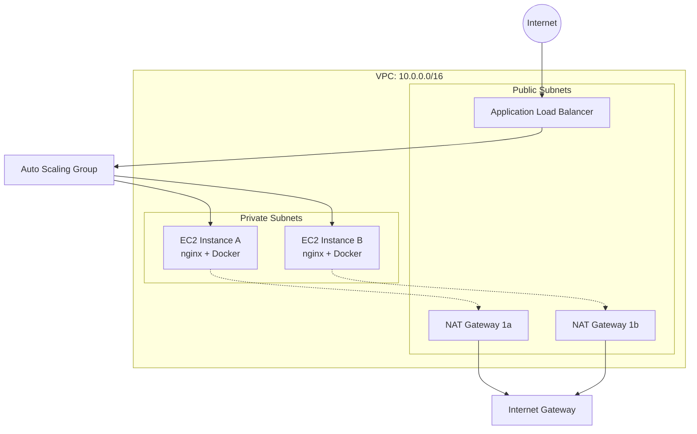

# InkoMoko Platform

<div align="center">
  

  **A production POC Application for InkoMoko**

  [](https://github.com/Blue-Davinci/InkoMoko/actions/workflows/ci-cd.yml)
  [
  [](https://github.com/Blue-Davinci/InkoMoko/actions/workflows/dependencies.yml)

  [](https://golang.org/)
  [](https://terraform.io/)
  [](https://aws.amazon.com/)
  [](https://docker.com/)
  [](https://nginx.org/)
</div>

## 🏗️ Architecture Overview

This project demonstrates a production-ready, cloud-native application platform featuring:

- **Go REST API** with comprehensive health checks and metrics
- **Infrastructure as Code** using Terraform with modular design
- **Auto Scaling** compute infrastructure with Application Load Balancer
- **GitHub Actions CI/CD** with security scanning and automated deployments
- **Security Best Practices** with VPC isolation and least-privilege access
- **Monitoring & Observability** with CloudWatch integration



## 🚀 Quick Start

### Prerequisites

- **Go 1.24+**
- **Terraform 1.12+**
- **AWS CLI** configured with appropriate permissions
- **Docker** (for containerization)
- **Make** (for build automation)

### 1. Clone and Setup

```bash
git clone <repository-url>
cd InkoMoko

# Install pre-commit hooks
make pre-commit/install

# Verify setup
make quality/check
```

### 2. Deploy Infrastructure

```bash
# Initialize Terraform backend
cd depoyment/terraform/backend
terraform init && terraform apply

# Deploy development environment
cd ../environments/dev
terraform init && terraform apply
```

### 3. Build and Deploy Application

```bash
# Build the Go application
make build

# Run tests
make test

# Build Docker image
make docker/build

# Deploy to infrastructure
make deploy
```

## 📁 Project Structure

```
InkoMoko/
├── 📁 cmd/                          # Application entry points
│   └── server/                      # Main server application
├── 📁 internal/                     # Private application code
│   ├── handlers/                    # HTTP request handlers
│   ├── middleware/                  # HTTP middleware
│   └── models/                      # Data models
├── 📁 pkg/                          # Public libraries
├── 📁 nginx/                        # Nginx configurations
│   ├── nginx-development.conf      # Development proxy config
│   └── nginx-production.conf       # Production proxy config
├── 📁 depoyment/                    # Infrastructure as Code
│   └── terraform/                   # Terraform configurations
│       ├── backend/                 # S3 backend setup
│       ├── environments/            # Environment-specific configs
│       └── modules/                 # Reusable Terraform modules
├── 📁 .github/                      # GitHub workflows (if applicable)
├── 📄 Dockerfile                    # Multi-stage Docker build
├── 📄 docker-compose.yml           # Local development setup
├── 📄 makefile                      # Build automation
├── 📄 .pre-commit-config.yaml      # Code quality hooks
└── 📄 go.mod                       # Go module definition
```

## 🔧 Development Workflow

### Code Quality & Testing

The project implements comprehensive quality controls:

```bash
# Run all quality checks
make quality/check

# Individual checks
make go/fmt          # Format Go code
make go/vet          # Vet Go code
make go/test         # Run Go tests
make terraform/fmt   # Format Terraform code
make terraform/validate  # Validate Terraform
make security/scan   # Security scanning with Checkov
```

### Pre-commit Hooks

Automated quality gates prevent bad code from being committed:

- **Go formatting** (`gofmt`)
- **Go vetting** (`go vet`)
- **Go testing** (`go test`)
- **Go mod tidy** (dependency management)
- **Terraform formatting** (`terraform fmt`)
- **Terraform validation** (`terraform validate`)
- **Security scanning** (Checkov)

## 🏛️ Infrastructure Architecture

### Networking Layer
- **VPC**: Isolated network environment (10.0.0.0/16)
- **Public Subnets**: ALB and NAT Gateways (2 AZs)
- **Private Subnets**: EC2 instances (2 AZs)
- **Route Tables**: Optimized routing for public/private traffic

### Compute Layer
- **Auto Scaling Group**: Dynamic scaling based on request load
- **Launch Template**: Consistent EC2 configuration
- **Application Load Balancer**: High-availability traffic distribution
- **Target Groups**: Health check and traffic routing

### Security Layer
- **Security Groups**: Least-privilege network access
- **IAM Roles**: Service-specific permissions
- **VPC Isolation**: Private subnet deployment
- **SSM Session Manager**: Secure shell access

## 🐳 Container Strategy

### Multi-Stage Docker Build

```dockerfile
# Build stage
FROM golang:1.21-alpine AS builder
WORKDIR /app
COPY go.* ./
RUN go mod download
COPY . .
RUN CGO_ENABLED=0 GOOS=linux go build -o main ./cmd/server

# Production stage
FROM alpine:latest
RUN apk --no-cache add ca-certificates
WORKDIR /root/
COPY --from=builder /app/main .
CMD ["./main"]
```

### Nginx Reverse Proxy

Production-ready nginx configuration with:
- **Load balancing** to backend services
- **Health checks** at `/health` endpoint
- **Rate limiting** (10 requests/second)
- **Gzip compression** for optimal performance
- **Security headers** for production hardening
- **Access logging** for monitoring

## 📊 Monitoring & Observability

### Health Checks
- **Application health**: `/v1/health/` endpoint
- **Metrics endpoint**: `/v1/health/metrics` (VPC-restricted)
- **ALB health checks**: Automated instance health monitoring

### Logging
- **Application logs**: Structured JSON logging
- **Nginx access logs**: Request tracking and performance metrics
- **System logs**: CloudWatch integration via SSM agent

## 🔐 Security Best Practices

### Network Security
- **Private subnets** for application instances
- **Security groups** with minimal required access
- **VPC endpoints** for AWS service communication
- **NAT Gateways** for secure outbound internet access

### Access Control
- **IAM roles** with least-privilege permissions
- **SSM Session Manager** for secure shell access
- **No SSH keys** required for instance access
- **Secrets management** via AWS Systems Manager

### Code Security
- **Checkov scanning** for infrastructure security
- **Go security best practices** implemented
- **Container security** with minimal attack surface
- **Regular dependency updates** via automated tools

## � CI/CD Pipeline

### GitHub Actions Automation

The platform includes a comprehensive CI/CD pipeline that demonstrates enterprise DevOps practices:

#### **Continuous Integration**
- **Quality Gates**: Go formatting, vetting, and testing with race detection
- **Security Scanning**: GoSec for code vulnerabilities, Checkov for infrastructure
- **Infrastructure Validation**: Multi-module Terraform validation and planning
- **Coverage Reporting**: Automated test coverage with detailed reports

#### **Continuous Deployment**
- **Multi-Environment**: Automated deployments to development and production
- **Container Registry**: Docker images published to GitHub Container Registry
- **Health Verification**: Post-deployment health checks and validation
- **Rollback Capability**: Git-based rollback with infrastructure state management

#### **Operational Workflows**
- **Dependency Updates**: Automated Go module and Terraform provider updates
- **Infrastructure Operations**: Manual infrastructure management with approval gates
- **Security Compliance**: Regular security scans and compliance reporting

```yaml
# Example: Automated deployment on push to main
on:
  push:
    branches: [ main, development ]
    paths-ignore: [ '**.md', 'docs/**' ]

jobs:
  deploy:
    if: github.ref == 'refs/heads/main'
    environment: production
    steps:
      - name: Deploy to Production
        run: |
          cd depoyment/terraform/environments/prod
          terraform init && terraform apply -auto-approve
```

For detailed CI/CD documentation, see [GitHub Actions Documentation](.github/README.md).

## �🚀 Deployment

### Environment Configuration

The platform supports multiple environments with isolated configurations:

```bash
# Development environment
cd depoyment/terraform/environments/dev
terraform workspace select dev
terraform apply

# Staging environment
cd depoyment/terraform/environments/staging
terraform workspace select staging
terraform apply
```

### Scaling Configuration

Auto Scaling Group parameters:
- **Minimum instances**: 1
- **Desired capacity**: 2
- **Maximum instances**: 3
- **Scaling metric**: ALB Request Count Per Target
- **Target value**: 100 requests per instance

## 📈 Performance Characteristics

### Load Testing Results
```bash
# Example load test results (placeholder - run actual tests)
$ wrk -t12 -c400 -d30s http://your-alb-dns/v1/health/

Running 30s test @ http://your-alb-dns/v1/health/
  12 threads and 400 connections
  Thread Stats   Avg      Stdev     Max   +/- Stdev
    Latency    45.32ms   12.14ms 150.23ms   68.45%
    Req/Sec   742.15    123.56     1.02k    71.23%
  267,890 requests in 30.05s, 42.15MB read
Requests/sec:   8,912.34
Transfer/sec:      1.40MB
```

## 🤝 Contributing

1. **Fork** the repository
2. **Create** a feature branch (`git checkout -b feature/amazing-feature`)
3. **Run** quality checks (`make quality/check`)
4. **Commit** changes (`git commit -m 'Add amazing feature'`)
5. **Push** to branch (`git push origin feature/amazing-feature`)
6. **Open** a Pull Request

## 📋 Make Targets

| Target | Description |
|--------|-------------|
| `make build` | Build the Go application |
| `make test` | Run Go tests with race detection |
| `make quality/check` | Run all quality checks |
| `make docker/build` | Build Docker image |
| `make terraform/init` | Initialize Terraform |
| `make terraform/plan` | Plan Terraform changes |
| `make terraform/apply` | Apply Terraform changes |
| `make pre-commit/install` | Install pre-commit hooks |
| `make pre-commit/run` | Run pre-commit hooks manually |

## 🏷️ Version Information

- **Application Version**: 1.0.0
- **Go Version**: 1.24+
- **Terraform Version**: 1.12+
- **AWS Provider**: ~> 5.0
- **Infrastructure State**: Terraform Cloud/AWS S3 Backend

## � Documentation

### Quick Start Guides
- **[HTTP Deployment](docs/QUICK_HTTPS_SETUP.md)** - Deploy with HTTP-only (immediate testing)
- **[HTTPS Setup](docs/HTTPS_IMPLEMENTATION.md)** - Complete HTTPS implementation guide

### Architecture & Infrastructure
- **[GitHub Actions Workflows](.github/README.md)** - CI/CD pipeline documentation
- **[Terraform Modules](depoyment/terraform/README.md)** - Infrastructure as Code details

### Access Methods

| Method | URL Format | Requirements | Security |
|--------|------------|--------------|----------|
| **HTTP (Testing)** | `http://alb-dns-name/health` | None | ⚠️ Development only |
| **HTTPS (Production)** | `https://yourdomain.com/health` | Custom domain + Route53 | ✅ SSL/TLS encrypted |

> **💡 Important**: You cannot access ALB via HTTPS using its DNS name (e.g., `my-alb-123.elb.amazonaws.com`).
> HTTPS requires a custom domain and SSL certificate. The HTTP endpoint works immediately for testing.

## �📞 Support

For questions, issues, or contributions:

- **Documentation**: See `/docs` directory
- **Issues**: GitHub Issues
- **Architecture**: See `/depoyment/terraform/README.md`

---

<div align="center">
  <strong>Built with ❤️ using Go, Terraform, and AWS</strong>
</div>
