# InkoMoko Infrastructure

<div align="center">
  

  **Enterprise Infrastructure as Code**

  [](https://terraform.io/)
  [](https://aws.amazon.com/)
  [](https://checkov.io/)
</div>

## 🏗️ Architecture Overview

This infrastructure implements a highly available, scalable, and secure cloud architecture on AWS using Infrastructure as Code (IaC) principles.

### High-Level Architecture

```mermaid
graph TB
    subgraph Internet ["🌐 Internet"]
        Users[Users]
    end

    subgraph AWS ["☁️ AWS Cloud"]
        subgraph VPC ["🏠 VPC (10.0.0.0/16)"]
            subgraph PublicSubnets ["🌍 Public Subnets"]
                ALB[🔄 Application<br/>Load Balancer]
                NAT1[🔀 NAT Gateway<br/>us-east-1a]
                NAT2[🔀 NAT Gateway<br/>us-east-1b]
            end

            subgraph PrivateSubnets ["🔒 Private Subnets"]
                ASG[📈 Auto Scaling<br/>Group]
                EC2A[🖥️ EC2 Instance<br/>us-east-1a]
                EC2B[🖥️ EC2 Instance<br/>us-east-1b]
            end

            IGW[🌉 Internet Gateway]
        end

        subgraph Storage ["💾 Storage & State"]
            S3[🪣 S3 Bucket<br/>Terraform State]
            KMS[🔐 KMS Key<br/>Encryption]
        end
    end

    Users --> ALB
    ALB --> ASG
    ASG --> EC2A
    ASG --> EC2B
    EC2A -.-> NAT1
    EC2B -.-> NAT2
    NAT1 --> IGW
    NAT2 --> IGW
    S3 --- KMS
```



## 📁 Infrastructure Structure

```
depoyment/terraform/
├── 📁 backend/                    # Terraform state management
│   ├── main.tf                   # S3 + KMS backend setup
│   ├── variables.tf              # Backend configuration variables
│   └── outputs.tf                # Backend resource outputs
├── 📁 environments/               # Environment-specific configurations
│   ├── dev/                      # Development environment
│   │   ├── main.tf               # Dev environment resources
│   │   ├── variables.tf          # Dev variables
│   │   ├── terraform.tfvars      # Dev values
│   │   ├── outputs.tf            # Dev outputs
│   │   └── backend.tf            # Backend configuration
│   └── staging/                  # Staging environment (future)
└── 📁 modules/                   # Reusable Terraform modules
    ├── networking/               # VPC, subnets, routing
    ├── alb/                     # Application Load Balancer
    └── compute/                 # Auto Scaling, EC2, IAM
```

## 🚀 Quick Start

### Prerequisites

```bash
# Required tools
terraform --version  # >= 1.5.0
aws --version        # >= 2.0.0
make --version       # Any recent version

# AWS credentials configured
aws configure list
```

### 1. Deploy Backend Infrastructure

```bash
# Navigate to backend directory
cd depoyment/terraform/backend

# Initialize and apply backend
terraform init
terraform plan
terraform apply
```

**Expected Output:**
```
Apply complete! Resources: 3 added, 0 changed, 0 destroyed.

Outputs:

kms_key_arn = "arn:aws:kms:us-east-1:123456789012:key/12345678-1234-1234-1234-123456789012"
kms_key_id = "12345678-1234-1234-1234-123456789012"
s3_bucket_arn = "arn:aws:s3:::inkomoko-tfstate-dev-bucket"
s3_bucket_name = "inkomoko-tfstate-dev-bucket"
```

### 2. Deploy Development Environment

```bash
# Navigate to dev environment
cd ../environments/dev

# Initialize with backend
terraform init

# Plan deployment
terraform plan

# Apply infrastructure
terraform apply
```

**Expected Output:**
```
Apply complete! Resources: 14 added, 0 changed, 0 destroyed.

Outputs:

alb_dns_name = "my-alb-dev-1234567890.us-east-1.elb.amazonaws.com"
application_url = "http://my-alb-dev-1234567890.us-east-1.elb.amazonaws.com"
environment = "dev"
instance_private_ips = [
  "10.0.3.45",
  "10.0.4.67"
]
```

## 🏗️ Infrastructure Modules

### 1. Networking Module (`modules/networking/`)

Creates the foundational network infrastructure:

**Resources Created:**
- **VPC** with DNS support enabled
- **Internet Gateway** for public internet access
- **Public Subnets** (2 AZs) for load balancers and NAT gateways
- **Private Subnets** (2 AZs) for application instances
- **NAT Gateways** (2) for high availability outbound internet
- **Route Tables** with optimized routing rules
- **Elastic IPs** for NAT gateways

**Key Features:**
- Multi-AZ deployment for high availability
- Optimized CIDR allocation (10.0.0.0/16)
- Automatic route table associations
- Cost-optimized NAT gateway configuration

**Usage Example:**
```hcl
module "networking" {
  source = "../../modules/networking"

  vpc_cidr        = "10.0.0.0/16"
  public_subnets = {
    "public-subnet-1a" = {
      cidr_block = "10.0.1.0/24"
      az         = "us-east-1a"
    }
    "public-subnet-1b" = {
      cidr_block = "10.0.2.0/24"
      az         = "us-east-1b"
    }
  }
  private_subnets = {
    "private-subnet-1a" = {
      cidr_block = "10.0.3.0/24"
      az         = "us-east-1a"
    }
    "private-subnet-1b" = {
      cidr_block = "10.0.4.0/24"
      az         = "us-east-1b"
    }
  }
  tags = {
    Environment = "dev"
    Project     = "InkoMoko"
  }
}
```

### 2. Application Load Balancer Module (`modules/alb/`)

Manages traffic distribution and SSL termination:

**Resources Created:**
- **Application Load Balancer** with cross-zone load balancing
- **Target Group** with health checks configured
- **Security Group** allowing HTTP/HTTPS traffic
- **Listener** for traffic forwarding rules

**Key Features:**
- Health checks on `/health` endpoint
- Security group with minimal required access
- Target tracking metrics for auto scaling
- Deletion protection (configurable)

**Health Check Configuration:**
```hcl
health_check {
  path                = "/health"
  protocol            = "HTTP"
  matcher             = "200-299"
  interval            = 30
  timeout             = 5
  healthy_threshold   = 2
  unhealthy_threshold = 3
}
```

### 3. Compute Module (`modules/compute/`)

Handles auto-scaling compute infrastructure:

**Resources Created:**
- **Auto Scaling Group** with target tracking scaling
- **Launch Template** with user data configuration
- **IAM Role** and Instance Profile for EC2 permissions
- **Security Group** allowing traffic from ALB only
- **Scaling Policy** based on ALB request count

**Key Features:**
- **Auto Scaling**: 1-3 instances based on load
- **Rolling Updates**: Zero-downtime deployments
- **SSM Integration**: Secure shell access via Session Manager
- **CloudWatch Integration**: Monitoring and logging
- **User Data**: Automated nginx + Docker setup

**User Data Script:**
```bash
#!/bin/bash
# Amazon Linux 2023 setup
dnf update -y
dnf install -y nginx docker amazon-ssm-agent

# Service configuration
systemctl enable docker amazon-ssm-agent nginx
systemctl start docker amazon-ssm-agent

# Application deployment
docker pull ${docker_image_url}
docker run -d --name inkomoko-api \
  --restart unless-stopped \
  -p 127.0.0.1:4000:4000 \
  ${docker_image_url}

systemctl start nginx
```

## 🔐 Security Implementation

### Network Security

**Defense in Depth:**
- **VPC Isolation**: Complete network isolation
- **Private Subnets**: Application instances have no direct internet access
- **Security Groups**: Stateful firewall rules
- **NACLs**: Network-level access controls (default)

**Security Group Rules:**
```hcl
# ALB Security Group
ingress {
  from_port   = 80
  to_port     = 80
  protocol    = "tcp"
  cidr_blocks = ["0.0.0.0/0"]  # Internet access
}

# EC2 Security Group
ingress {
  from_port       = 80
  to_port         = 80
  protocol        = "tcp"
  security_groups = [aws_security_group.alb_sg.id]  # ALB only
}
```

### Access Control

**IAM Roles and Policies:**
- **EC2 Instance Role**: Minimal permissions for SSM and CloudWatch
- **No SSH Keys**: Session Manager for secure access
- **Least Privilege**: Each service has only required permissions

**SSM Session Manager Access:**
```bash
# Secure shell access without SSH keys
aws ssm start-session --target i-1234567890abcdef0 --region us-east-1
```

### Secrets Management

- **KMS Encryption**: Terraform state encryption at rest
- **Systems Manager**: Parameter Store for configuration
- **No Hardcoded Secrets**: All sensitive data externalized

## 📊 Infrastructure Monitoring

### CloudWatch Integration

**Metrics Collected:**
- **ALB Metrics**: Request count, response time, error rates
- **EC2 Metrics**: CPU, memory, network utilization
- **Auto Scaling Metrics**: Scaling activities and capacity

**Log Groups:**
- **/aws/ec2/user-data**: Instance initialization logs
- **/var/log/nginx**: Web server access and error logs
- **/var/log/application**: Application-specific logs

### Scaling Metrics

**Target Tracking Configuration:**
```hcl
target_tracking_configuration {
  predefined_metric_specification {
    predefined_metric_type = "ALBRequestCountPerTarget"
    resource_label         = "${aws_lb.main.arn_suffix}/${aws_lb_target_group.main.arn_suffix}"
  }
  target_value     = 100  # Requests per instance
  disable_scale_in = false
}
```

## 💰 Cost Optimization

### Resource Sizing

**Instance Types:**
- **Development**: t3.micro (1 vCPU, 1GB RAM)
- **Staging**: t3.small (2 vCPU, 2GB RAM)
- **Production**: t3.medium+ (based on load testing)

**NAT Gateway Optimization:**
- **Single NAT per AZ**: Balanced cost vs availability
- **Lifecycle Policies**: S3 state bucket cost management

### S3 Lifecycle Policy

```hcl
lifecycle_rule {
  id     = "terraform_state_lifecycle"
  status = "Enabled"

  noncurrent_version_transition {
    noncurrent_days = 30
    storage_class   = "STANDARD_IA"
  }

  noncurrent_version_expiration {
    noncurrent_days = 90
  }
}
```

## 🔧 Operational Procedures

### Deployment Workflow

1. **Code Changes**: Update Terraform configurations
2. **Quality Checks**: Pre-commit hooks and manual review
3. **Plan**: `terraform plan` to preview changes
4. **Apply**: `terraform apply` with approval
5. **Verification**: Health checks and monitoring

### Scaling Operations

**Manual Scaling:**
```bash
# Update desired capacity
aws autoscaling update-auto-scaling-group \
  --auto-scaling-group-name my-instance-dev-asg \
  --desired-capacity 3
```

**Emergency Scale-Out:**
```bash
# Immediate scale to maximum
aws autoscaling update-auto-scaling-group \
  --auto-scaling-group-name my-instance-dev-asg \
  --desired-capacity 3 \
  --max-size 5
```

### Disaster Recovery

**RTO/RPO Targets:**
- **RTO (Recovery Time Objective)**: 15 minutes
- **RPO (Recovery Point Objective)**: 1 hour

**Recovery Procedures:**
1. **Infrastructure**: `terraform apply` from version control
2. **Application**: Auto Scaling Group launches new instances
3. **Data**: S3 cross-region replication (if configured)

## 🧪 Testing Strategy

### Infrastructure Testing

**Validation Pipeline:**
```bash
# Format check
terraform fmt -check=true -diff=true

# Validation
terraform validate

# Security scan
checkov --directory . --quiet --compact

# Plan verification
terraform plan -detailed-exitcode
```

### Security Testing

**Checkov Security Scans:**
- **CKV_AWS_18**: S3 bucket logging (skipped for dev)
- **CKV_AWS_144**: S3 bucket replication (skipped for dev)
- **CKV2_AWS_62**: VPC default security group (acceptable)
- **CKV_AWS_21**: S3 versioning (enabled via lifecycle)

### Load Testing

**Infrastructure Load Test:**
```bash
# ALB load testing
wrk -t12 -c400 -d30s \
  http://my-alb-dev-1234567890.us-east-1.elb.amazonaws.com/health

# Expected: Auto scaling triggers at 100 requests/instance
```

## 📋 Terraform Commands Reference

| Command | Purpose |
|---------|---------|
| `terraform init` | Initialize working directory |
| `terraform plan` | Create execution plan |
| `terraform apply` | Apply changes |
| `terraform destroy` | Destroy infrastructure |
| `terraform fmt` | Format configuration files |
| `terraform validate` | Validate configuration |
| `terraform state list` | List resources in state |
| `terraform output` | Show output values |

## 🏷️ Variables Reference

### Required Variables

```hcl
variable "vpc_cidr" {
  description = "CIDR block for VPC"
  type        = string
  default     = "10.0.0.0/16"
}

variable "environment" {
  description = "Environment name"
  type        = string
}

variable "instance_ami" {
  description = "AMI ID for EC2 instances"
  type        = string
  default     = "ami-08a6efd148b1f7504"  # Amazon Linux 2023
}

variable "instance_type" {
  description = "EC2 instance type"
  type        = string
  default     = "t3.micro"
}
```

### Output Values

```hcl
output "alb_dns_name" {
  description = "DNS name of the load balancer"
  value       = module.alb.alb_dns_name
}

output "application_url" {
  description = "URL to access the application"
  value       = "http://${module.alb.alb_dns_name}"
}

output "instance_private_ips" {
  description = "Private IP addresses of instances"
  value       = module.compute.instance_private_ips
}
```

## 🚨 Troubleshooting

### Common Issues

**Issue: Terraform State Lock**
```bash
# Force unlock (use with caution)
terraform force-unlock <lock-id>
```

**Issue: Failed Health Checks**
```bash
# Check instance logs
aws ssm start-session --target <instance-id>
sudo tail -f /var/log/user-data.log
sudo systemctl status nginx docker
```

**Issue: Scaling Not Triggered**
```bash
# Check CloudWatch metrics
aws cloudwatch get-metric-statistics \
  --namespace AWS/ApplicationELB \
  --metric-name RequestCountPerTarget \
  --start-time 2024-01-01T00:00:00Z \
  --end-time 2024-01-01T01:00:00Z \
  --period 300 \
  --statistics Average
```

## 📞 Support & Maintenance

### Regular Maintenance Tasks

- **Weekly**: Review CloudWatch metrics and alarms
- **Monthly**: Update AMI IDs for security patches
- **Quarterly**: Review and optimize costs
- **Annually**: Disaster recovery testing

### Emergency Contacts

- **Infrastructure**: Platform Engineering Team
- **Application**: Development Team
- **Security**: Security Operations Center

---

<div align="center">
  <strong>Infrastructure managed with Terraform • Secured by design • Optimized for scale</strong>
</div>
